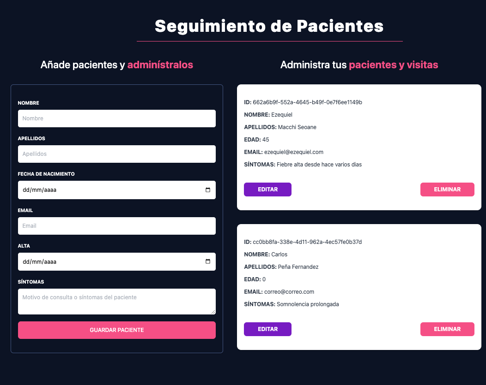

# Pacientes Zustand — Gestión de Pacientes con React + Zustand


---

## 📄 Descripción

**Pacientes Zustand** es una aplicación frontend desarrollada con **React + TypeScript**, diseñada para gestionar pacientes de forma intuitiva. Permite registrar, visualizar, editar y eliminar pacientes mediante un formulario controlado y una lista interactiva. Todo el estado de la aplicación se maneja globalmente con **Zustand**, y la interfaz está optimizada para una experiencia fluida y responsive.

---

## 🖼️ Capturas

#### Formulario de paciente y lista de detalles



---

## ✨ Funcionalidades

- Registro de pacientes con validaciones personalizadas
- Edición de pacientes existentes desde la misma interfaz
- Eliminación con confirmación visual y notificación
- Visualización de lista con detalles individuales
- Estado global manejado con **Zustand**
- Interfaz responsive y estilizada con **Tailwind CSS**
- Notificaciones contextuales con **React Toastify**

---

## 💻 Tecnologías Utilizadas

- **React 18**
- **TypeScript**
- **Zustand**
- **React Hook Form**
- **Tailwind CSS**
- **React Toastify**
- **Vite** (build y desarrollo)

---

## 📋 Requisitos

- Node.js v18 o superior
- Navegador moderno (Chrome, Firefox, etc.)
- Git

---

## 🧱 Estructura del Proyecto

```bash
Pacientes-Zustand/
├── src/
│   ├── components/           # Componentes principales
│   ├── types/                # Definiciones TypeScript
│   ├── store.ts              # Estado global con Zustand
│   ├── utils.ts              # Funciones auxiliares
│   ├── App.tsx               # Componente raíz
│   ├── main.tsx              # Punto de entrada
│   └── index.css             # Estilos globales con Tailwind
├── public/
├── dist/                     # Archivos compilados (Vite)
├── index.html
├── package.json
├── tailwind.config.js
├── vite.config.ts
└── tsconfig.json

```
---

## 🛠️ Instalación

```bash
git clone https://github.com/eze-ms/Patient-Management-React-Zustand

```

### Instalar dependencias
```bash
npm install
```

### Iniciar servidor
```bash
npm run dev
```
---

© 2024. Proyecto desarrollado por Ezequiel Macchi Seoane

